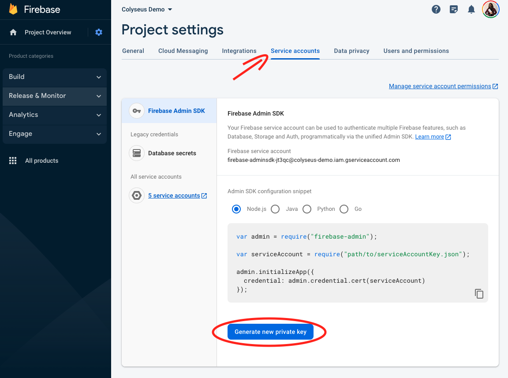

# Colyseus + Firebase Auth Demo

**Quick reference:**

- [Setting-up 'firebase-admin' on the server](https://github.com/colyseus/demo-firebase-authentication/blob/main/server/src/rooms/MyRoom.ts#L11)
- [Providing Firebase's `accessToken` from client-side to the server-side](https://github.com/colyseus/demo-firebase-authentication/blob/main/client/src/index.js#L20-L24)
- [Verifying token provided by client on the server-side](https://github.com/colyseus/demo-firebase-authentication/blob/main/server/src/rooms/MyRoom.ts#L20-L22)
- [Accessing authenticated user's data on the server-side](https://github.com/colyseus/demo-firebase-authentication/blob/main/server/src/rooms/MyRoom.ts#L26)

**Requirements:**

- [Create a Firebase App](https://firebase.google.com/docs/web/setup#create-project)
- Add "Anonymous" and "Email/Password" as Authentication providers on Firebase:
	- Firebase Console > Authentication > Sign-in method > Anonymous > Enable
	- Firebase Console > Authentication > Sign-in method > Email/Password > Enable
- Configure both client and server with the Firebase App credentials, as documented below


### Client-side

Replace the `firebaseConfig` from `client/src/firebase.js` with your Firebase app's credentials.

Starting the client:

```
npm install
npm start
```

### Server-side

(We are following the ["Initialize the SDK in non-Google environments"](https://firebase.google.com/docs/admin/setup#initialize_the_sdk_in_non-google_environments) documentation here.)

Add your `service-account-file.json` file to the `server/` folder.

You can get this file from the "Firebase Console" > "Project Settings" > "Service Accounts" > "Generate New Private Key".



Starting the server:

```
npm install
npm start
```